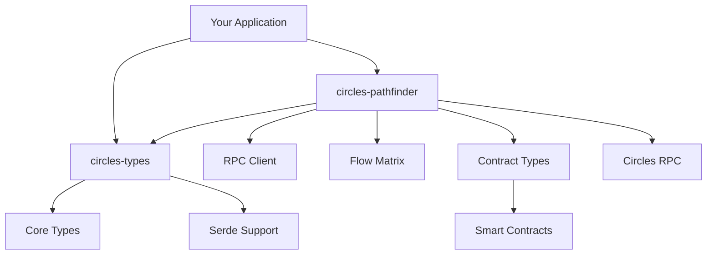

# Circles SDK Rust

A comprehensive Rust implementation of the Circles protocol SDK, providing complete type definitions, pathfinding, RPC communication, contract interactions, and type-safe operations for the Circles ecosystem.

## Overview

The Circles protocol enables a network of interconnected personal currencies, allowing users to create their own tokens and establish trust relationships for peer-to-peer transfers. This SDK provides the core building blocks for interacting with the Circles network in Rust applications.

## Features

- **Complete Protocol Coverage**: Comprehensive types for avatars, trust relations, tokens, groups, events, and more
- **Pathfinding**: Discover optimal transfer routes through the Circles trust network
- **Flow Matrix Calculation**: Generate contract-ready flow matrices for multi-hop transfers
- **RPC Integration**: Full JSON-RPC client support with query DSL for circles_query
- **Event System**: Complete event handling with 25+ supported event types
- **Type Safety**: Strongly-typed Ethereum addresses and amounts with compile-time guarantees
- **Alloy Integration**: Built on alloy-primitives for seamless Ethereum compatibility
- **API Compatibility**: Direct compatibility with TypeScript Circles SDK
- **Async Ready**: Async traits for contract runners and batch operations
- **Contract Integration**: Direct compatibility with Circles smart contract ABIs

## Workspace Structure

This workspace contains multiple crates:

- **[`circles-types`](crates/types/)** - Complete type definitions for the entire Circles protocol ecosystem
- **[`circles-pathfinder`](crates/pathfinder/)** - Pathfinding algorithms and contract integration  
- **[`abis`](crates/abis/)** - Contract ABI definitions for all Circles smart contracts

## Quick Start

Add the crates to your `Cargo.toml`:

```toml
[dependencies]
circles-types = "0.3.0"
circles-pathfinder = "0.4.0"
abis = "0.1.0"
```

### Basic Pathfinding Example

```rust
use circles_pathfinder::{prepare_flow_for_contract, FindPathParams};
use alloy_primitives::{Address, U256};

#[tokio::main]
async fn main() -> Result<(), Box<dyn std::error::Error>> {
    let params = FindPathParams {
        from: "0x1234567890123456789012345678901234567890".parse()?,
        to: "0x0987654321098765432109876543210987654321".parse()?,
        target_flow: U256::from(1_000_000_000_000_000_000u64), // 1 token
        use_wrapped_balances: Some(true),
        from_tokens: None,
        to_tokens: None,
        exclude_from_tokens: None,
        exclude_to_tokens: None,
    };

    let flow_matrix = prepare_flow_for_contract(
        "https://rpc.aboutcircles.com/",
        params
    ).await?;

    println!("Flow matrix ready with {} vertices", flow_matrix.flow_vertices.len());

    // Use with smart contract calls
    let (vertices, edges, streams, coordinates) = flow_matrix.into_contract_params();
    // contract.transferFlow(vertices, edges, streams, coordinates).send().await?;

    Ok(())
}
```

### Working with Types

```rust
use circles_types::{
    AvatarInfo, AvatarType, CirclesConfig, Address, TxHash, U256,
    FindPathParams, Balance, TokenBalanceResponse
};

// Create avatar information
let avatar = AvatarInfo {
    block_number: 12345,
    timestamp: Some(1234567890),
    transaction_index: 1,
    log_index: 0,
    transaction_hash: "0xabc123...".parse()?,
    version: 2,
    avatar_type: AvatarType::CrcV2RegisterHuman,
    avatar: "0x123...".parse()?,
    token_id: Some(U256::from(1)),
    has_v1: false,
    v1_token: None,
    cid_v0_digest: None,
    cid_v0: None,
    v1_stopped: None,
    is_human: true,
    name: None,
    symbol: None,
};

// Work with flexible balance types
let balance = Balance::Raw(U256::from(1000000000000000000u64)); // 1 token
match balance {
    Balance::Raw(amount) => println!("Raw: {}", amount),
    Balance::TimeCircles(amount) => println!("TimeCircles: {:.6}", amount),
}

// Serialize to JSON for API calls
let json = serde_json::to_string(&avatar)?;
```

## Crate Documentation

### circles-types

Complete type definitions for the Circles protocol ecosystem. Provides comprehensive data structures for all protocol aspects with full serde serialization support:

**Core Types:**
- `Address`, `TxHash`, `U256` - Ethereum primitives (re-exported from alloy)
- `TransactionRequest`, `Balance` - Transaction and balance handling

**Protocol Types:**
- `AvatarInfo`, `Profile`, `AvatarType` - Avatar and profile management
- `TrustRelation`, `TrustRelationType` - Trust network relationships
- `TokenBalance`, `TokenInfo` - Token operations and metadata
- `CirclesEvent`, `CirclesEventType` - Complete event system (25+ types)
- `GroupRow`, `GroupMembershipRow` - Group management
- `FindPathParams`, `PathfindingResult` - Pathfinding operations
- `QueryParams`, `FilterPredicate` - Query DSL for RPC calls
- `CirclesConfig` - Protocol configuration

**Contract Integration:**
- `ContractRunner`, `BatchRun` - Async traits for contract execution
- `FlowMatrix`, `TransferStep` - Flow calculations and transfers
- `JsonRpcRequest`, `JsonRpcResponse` - RPC communication

**[View Documentation](crates/types/)**

### circles-pathfinder

Pathfinding algorithms and smart contract integration for the Circles network:

- Path discovery through trust networks
- Flow matrix generation for multi-hop transfers
- Contract-compatible type conversions
- Balance checking and liquidity analysis
- Coordinate packing for efficient on-chain storage

**[View Documentation](crates/pathfinder/)**

## Development

### Prerequisites

- Rust 1.75+
- Cargo

### Building

```bash
# Clone the repository
git clone https://github.com/deluXtreme/circles-rs.git
cd circles-rs

# Build all crates
cargo build

# Run tests
cargo test

# Check all crates
cargo check --workspace
```

### Running Examples

```bash
# Run pathfinder examples
cd crates/pathfinder
cargo run --example basic_pathfinding

# Run with specific RPC endpoint
RPC_URL=https://your-rpc-endpoint.com cargo run --example basic_pathfinding
```

### Testing

The workspace includes comprehensive tests:

```bash
# Run all tests
cargo test --workspace

# Run specific crate tests
cargo test -p circles-types
cargo test -p circles-pathfinder

# Run with output
cargo test --workspace -- --nocapture
```

## Architecture



## RPC Endpoints

The pathfinder connects to Circles RPC endpoints:

- **Mainnet**: `https://rpc.aboutcircles.com/`

## Contributing

We welcome contributions! Please see our [Contributing Guidelines](CONTRIBUTING.md) for details.

### Development Workflow

1. Fork the repository
2. Create a feature branch
3. Make your changes
4. Add tests for new functionality
5. Ensure all tests pass
6. Submit a pull request

### Code Style

- Use `cargo fmt` for formatting
- Use `cargo clippy` for linting
- Follow Rust naming conventions (snake_case)
- Add documentation for public APIs

## Versioning

This project follows [Semantic Versioning](https://semver.org/). See individual crate changelogs for detailed version information:

- [circles-types changelog](crates/types/CHANGELOG.md)
- [circles-pathfinder changelog](crates/pathfinder/CHANGELOG.md)
- [Workspace changelog](CHANGELOG.md)

## License

This project is licensed under either of

- Apache License, Version 2.0, ([LICENSE-APACHE](LICENSE-APACHE) or http://www.apache.org/licenses/LICENSE-2.0)
- MIT license ([LICENSE-MIT](LICENSE-MIT) or http://opensource.org/licenses/MIT)

at your option.

## Acknowledgments

- Built on [alloy-rs](https://github.com/alloy-rs/alloy) for comprehensive Ethereum type compatibility and RPC functionality
- API-compatible with the [TypeScript Circles SDK](https://github.com/aboutcircles/circles-sdk)
- Part of the [Circles Protocol](https://aboutcircles.com/) ecosystem

---

**[Learn more about Circles](https://aboutcircles.com/) | [Documentation](https://docs.aboutcircles.com/)
